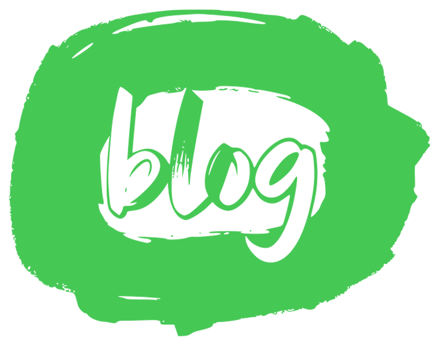

<div align="center">
  

  <h1>🖋️ From My Life – Personal Blog Platform</h1>

  <p>
    <strong>A high-performance, full-stack blogging platform built with React and Django.</strong>
  </p>

  <p>
    <a href="#features">Features</a> •
    <a href="#tech-stack">Tech Stack</a> •
    <a href="#installation-and-setup">Installation</a> •
    <a href="#architecture">Architecture</a>
  </p>

  <p>
    
    
    
    
  </p>
</div>

<br />

## 🌟 About The Project

**From My Life** is a fully custom-built blogging ecosystem designed to bridge the gap between aesthetic presentation and robust content management. It offers a stunning reader experience for articles on development, entrepreneurship, and personal growth, coupled with a feature-rich, role-based Admin Dashboard for content creators.

Whether you're browsing the latest stories, filtering by categories, or subscribing to the newsletter, the seamless integration of a Django REST API and a React SPA ensures instant navigation and a smooth user experience.

---

## ✨ Key Features

### 📖 Reader Experience
- **Dynamic Content:** Read rich-text posts categorized into *Showcase, Education, Business, Insight,* and *Lifestyle*.
- **Smart Filtering:** URL-synchronized category filtering for seamless link sharing.
- **Newsletter Subscription:** Custom email opt-in form powered by backend uniqueness validation.
- **Responsive Aesthetics:** Fluid typography, pixel-perfect UI elements, and glassmorphism elements targeting modern web aesthetics.

### 🛡️ Admin & Author Dashboard
- **Role-Based Access Control (RBAC):** Distinct privileges for Superadmins vs. Authors. Admins can manage the user directory; authors can only manage their own content.
- **Advanced Metrics:** SVG-based multi-series line charts tracking posts, views, and newsletter subscriptions over time.
- **Content Management:** Create, draft, and publish articles with a dedicated rich-text editor environment.
- **JWT Authentication:** Secure token-based local login system protecting all administrative routes.

---

## 🛠️ Tech Stack

### Frontend `(React)`
- **Framework:** React.js
- **Routing:** React Router v6
- **Styling:** Pure Vanilla CSS (Variables, Grid, Flexbox, Custom Micro-animations)
- **Icons:** Lucide React
- **Data Fetching:** Fetch API / Async-Await

### Backend `(Django)`
- **Framework:** Django & Django REST Framework (DRF)
- **Database:** SQLite / PostgreSQL
- **Authentication:** SimpleJWT (JSON Web Tokens)
- **CORS:** Django-CORS-Headers

---

## 🚀 Installation and Setup

To get a local copy up and running, follow these simple steps.

### Prerequisites
- Python 3.9+
- Node.js v16+ (and npm)

### 1. Clone the repo
```bash
git clone https://github.com/TemesgenMeles/BlogWebsite.git
cd BlogWebsite
```

### 2. Backend Setup
Navigate to the backend directory, set up your virtual environment, and start the server.
```bash
cd backend
python -m venv venv
source venv/bin/activate  # On Windows: venv\Scripts\activate
pip install -r requirements.txt

# Run database migrations
python manage.py migrate

# Create a superuser for the Admin Dashboard
python manage.py createsuperuser

# Start the Django server
python manage.py runserver
```
*The API will be available at `http://127.0.0.1:8000/`*

### 3. Frontend Setup
Open a new terminal window, navigate to the frontend directory, install dependencies, and start the development server.
```bash
# Navigate to the frontend workspace
cd Frontend/From_My_Life

# Install Node dependencies
npm install

# Start the Vite/CRA server
npm run dev
```
*The React app will instantly compile and be accessible via `http://localhost:5173` (or port 3000).*

---

## 📂 Project Architecture

```raw
BlogWebsite/
├── backend/                   # Django REST Framework API
│   ├── FML_APIs/              # Core API logic, views, models, and serializers
│   ├── backend/               # Django settings and URL routing
│   └── manage.py              # Django entry point
│
└── Frontend/From_My_Life/     # React SPA Web App
    ├── public/                # Static assets (logos, fallback images)
    ├── src/                   # React root, global App.css, layout wrappers
    └── Components/
        ├── layout/            # Reusable header, footer, admin sidebar
        └── pages/             # Route pages (Home, Posts, Contact, About, Admin)
```

---

## 💌 Contact & Credit

Designed & Developed by **Temesgen Meles**.

If you liked this project or want to collaborate, feel free to reach out via [LinkedIn](#) or review the source code here on [GitHub](https://github.com/TemesgenMeles).

<div align="center">
  <sub>Built with ❤️ and coffee.</sub>
</div>